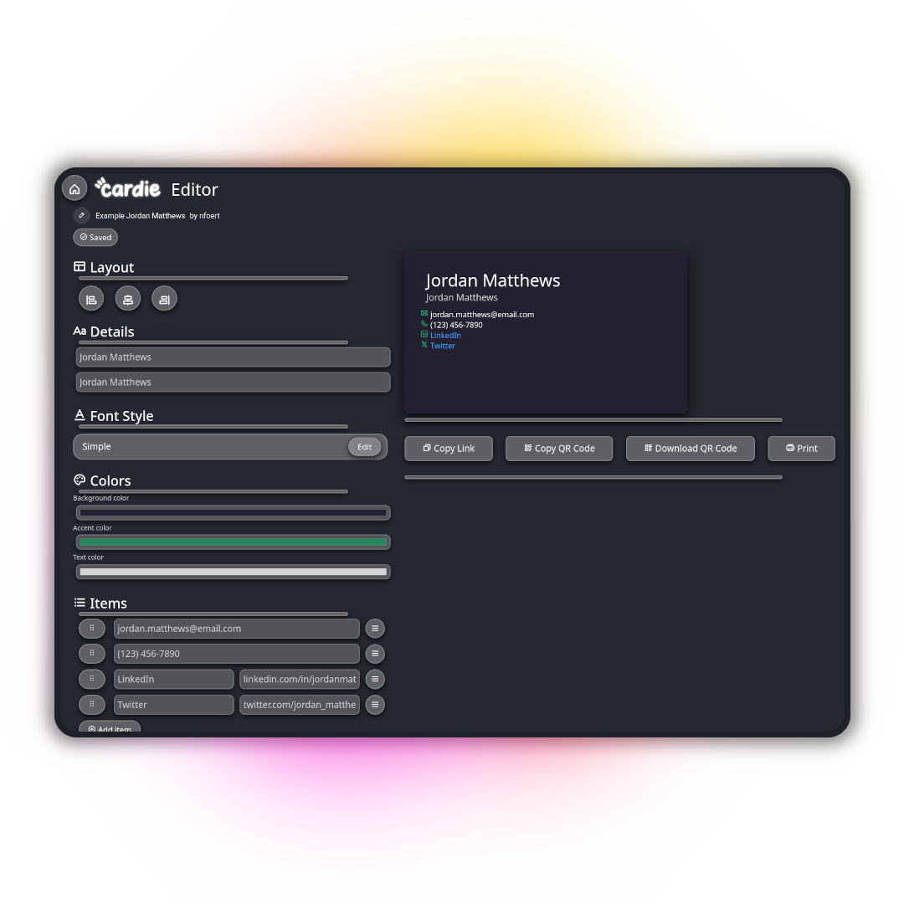

<div align="center">
  
</div>

<div align="center">
  <h1>Cardie</h1>

  [](https://discord.gg/G24Ag9FqB8)

  **[Live Server](https://cardie-uwtwy.ondigitalocean.app/)**

  [](https://github.com/nfoert/cardie/issues)
  [](https://github/nfoert/cardie/blob/main/LICENSE)

</div>

Design a unlimited number of business or information cards about yourself, share a link or QR code to them, print it out, and save other people's cards to your virtual wallet for later. Once you've created a card you can get analytics data on how your cards are getting visited, you can edit your cards as things change, and you can keep cards private so only people with a link to your card can see it.

<div align="center">
  <a href="https://skillicons.dev">
    
  </a>
</div>

<div align="center">
  
</div>

> [!IMPORTANT]
> Cardie is currently in an open alpha. Things will be rapidly changing and bugs are to be expected.

## Installation

First, clone this repository using the following command
```
git clone https://github.com/nfoert/cardie
```

Then, navigate to that directory and create a new python virtual environment
```
cd cardie
python3 -m venv .venv
```

Activate the virtual environment using the command for your system (Linux is used here) and install the required dependencies
```
source ./.venv/bin/activate
pip install -r requirements.txt
```

Next, create a django superuser and make and migrate the models
```
cd cardie
python manage.py createsuperuser
python manage.py makemigrations
python manage.py migrate
```

Now just run the server using the following command, or run the `Start server` task in your Visual Studio Code
```
python manage.py runserver
```

Finally, navigate to `http://127.0.0.1:8000/admin` and log in using your new administrator account. Create a new `Server` object and be sure to configure the `ip` to be `http://127.0.0.1:8000`.

### Additional steps for Production installation
This depends on what server hosting provider you're using. However, there's a couple environment variables you need to set and there's a run command.

Set the following global environment variables:
- `DJANGO_ALLOWED_HOSTS` -> `${APP_DOMAIN}` (This works on DigitalOcean, this may not work on every hosting provider)
- `DJANGO_SETTINGS_MODULE` -> `cardie.settings_production`
- `STATIC_URL` -> `/static/main`

- `SECRET_KEY` -> `<your new secret key>` (Generate this using `django.core.management.utils.get_random_secret_key()`. If possible you should encrypt this value in your hosting provider.)
- `DEBUG` -> `False`
- `DATABASE_URL` -> `${db.DATABASE_URL}` (This works on DigitalOcean, this may not work on every hosting provider)

## To Do
There's lots of things that need implemented or changed in this project. Please see [TODO.md](TODO.md).

## Contributing
I'd love to see contributions to this project! Please check out the [issues](https://github.com/nfoert/issues) page to see what things currently need fixed or added.